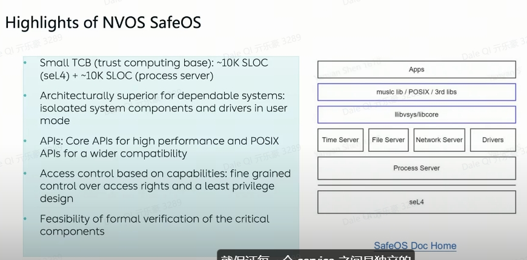

# sel4

## 首先说什么是微内核？和宏内核的区别
https://blog.csdn.net/usstmiracle/article/details/118568080
1. 相比于像Windows或Linux这种monolithic OS把设备驱动（device driver）、CPU调度、虚拟内存、进程通信、文件系统等等全部放到内核里
2. sel4这种microkernel OS，仅仅将进程调度（IPC）和虚拟内存等放在内核，其他的都作为应用程序
## 微内核的优势？
1. 有科学方法表面微内核的操作系统有更好的安全性和响应速度
2. 比如宏内核操作系统如果某个系统（比如文件系统）挂了，就会导致整个操作系统瘫痪
3. 而微内核由于这些系统都是在用户层，不会影响到内核，不会轻易瘫痪
4. safeos是sel4为基础的微内核操作系统，在sel4基础之上，时间调度，内存调度，文件系统，设备管理等都在用户层面
5.   

## Hypervisor介绍
https://zhuanlan.zhihu.com/p/185946700